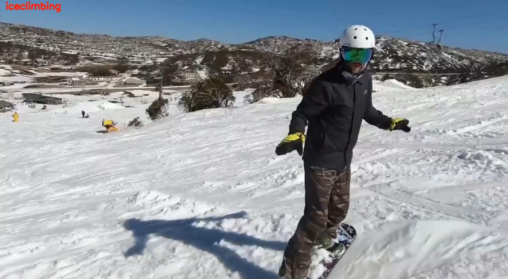
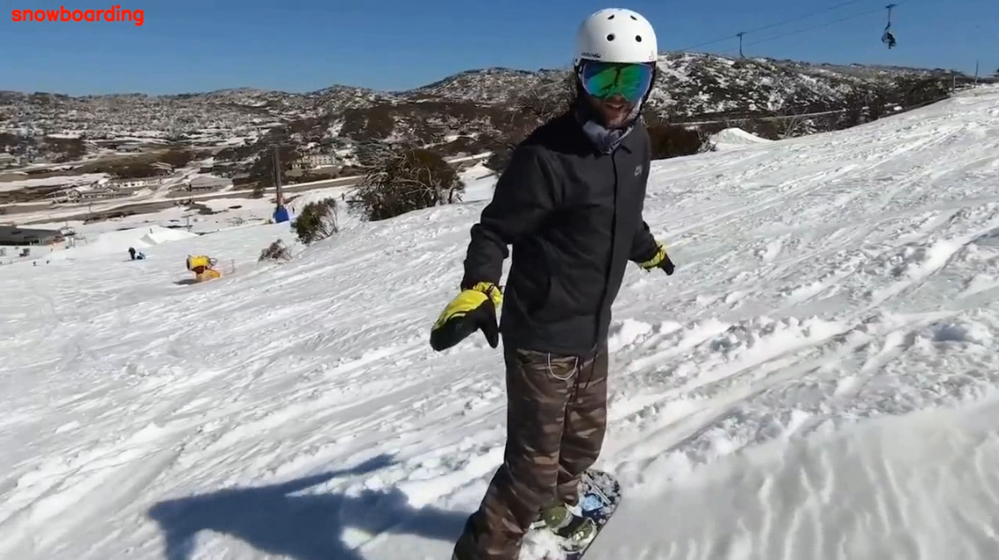
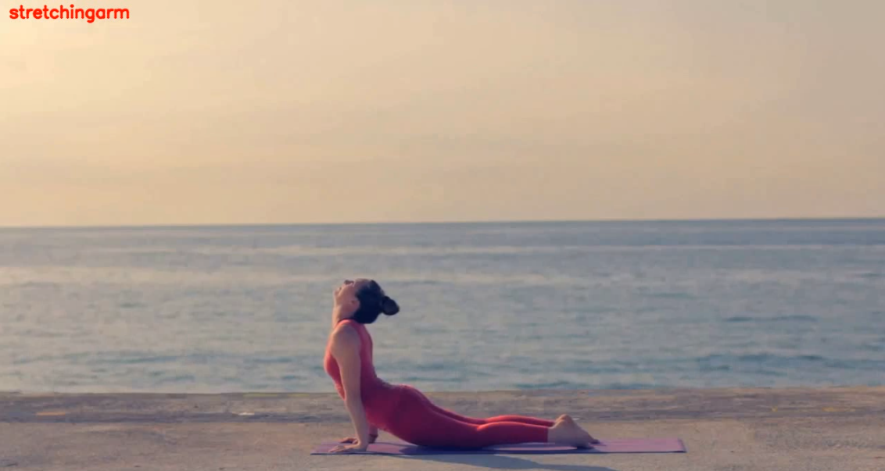
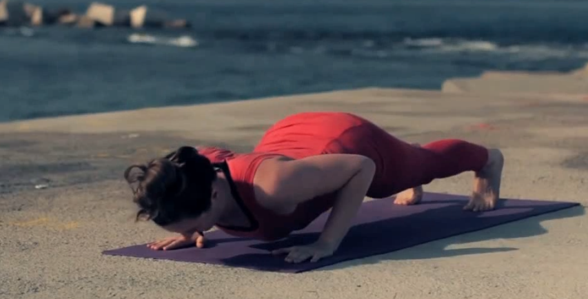
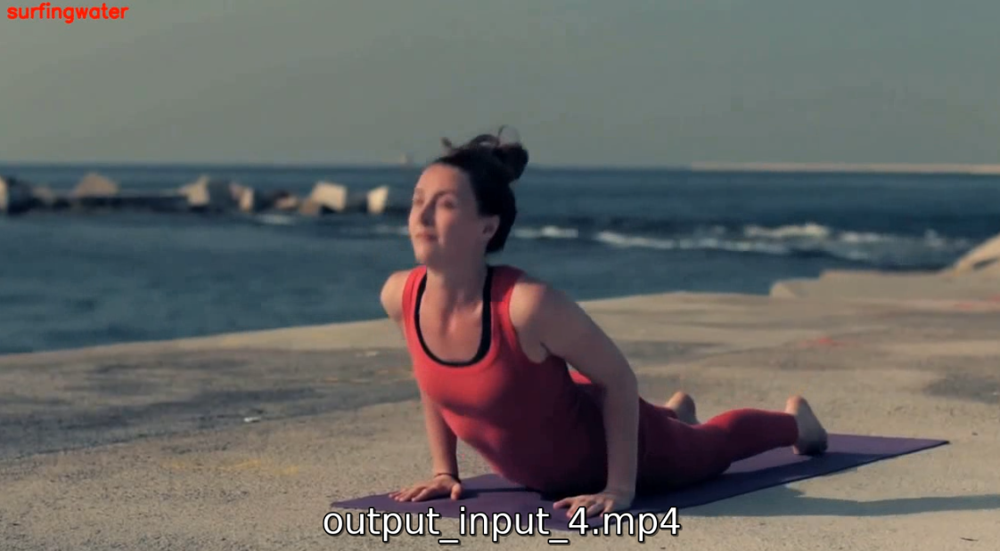
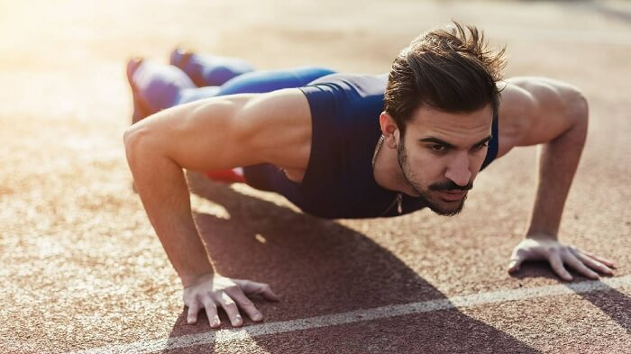
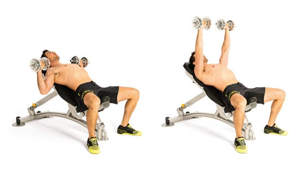
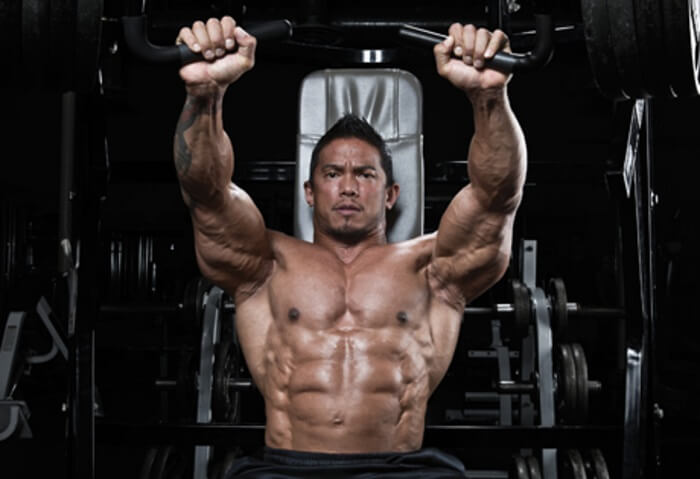
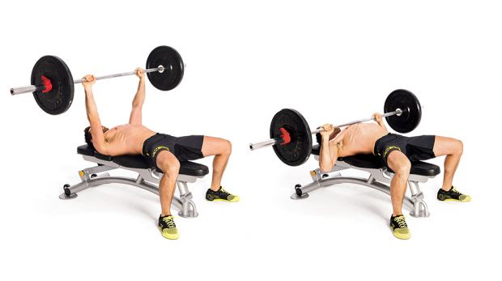
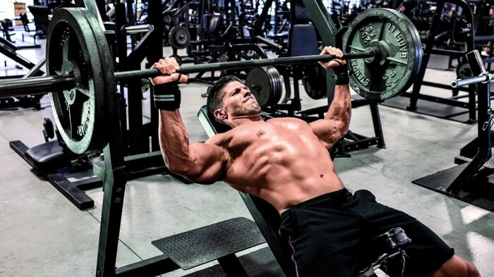

# Task 6(NLP): Blog Post Similarity

Given any two blog posts, find similarity among the posts based on examining two text entities, images etc. and determining whether they have the same meaning or not. 

## Solution

I started with dividing the task in two parts:-
 - Finding similarity between text entities of blog
 - Finding similarity between images 
 
### Text similarity
Document similarities is one of the most crucial problems of NLP. We can call two documents similar if they are semantically similar and define the same concept or if they are duplicates. 
Methodology:-
- I've used word2vec which embeds words into vector space. Word2vec takes a text corpus as input and produce word embeddings as output. Embeddings are the vector representations of text where word or sentences with similar meaning or context have similar representations.
- We can train a word2vec model ourselves, but for meaningful results we would need tons of documents. Also, that might take a lot of time with my computation limits. So, I'll be loading a pre-trained word2vec model from google. This model contains 300-dimensional vectors for 3 million words and phrases. Link to download it -> https://code.google.com/archive/p/word2vec/
- Now, for calculating similarites, I'll be using Cosine Distance/Similarity. It is the cosine of the angle between two vectors, which gives us the angular distance between the vectors.

**Results:**


You can find these results in jupyter notebook.
- First line, [OOPS QUESTIONS](https://www.mygreatlearning.com/blog/oops-interview-questions/) and [OOPS QUESTIONS(Different)](https://career.guru99.com/top-50-oops-interview-questions/) blogs are approximately 95% similar.
- Second line, [OOPS QUESTIONS](https://www.mygreatlearning.com/blog/oops-interview-questions/) and [C LANGUAGE](https://www.upgrad.com/blog/c-interview-questions-answers/) blogs are approximately 85% similar.
- Third line, [OOPS QUESTIONS](https://www.mygreatlearning.com/blog/oops-interview-questions/) and [PYTHON FLASK TUTORIAL](https://dev.to/gajesh/the-complete-flask-beginner-tutorial-124i) blogs are approximately 80% similar.
- Fourth line, [OOPS QUESTIONS](https://www.mygreatlearning.com/blog/oops-interview-questions/) and [HUMAN VALUES](https://stellamaryscoe.edu.in/human-values-ethics.php) blogs are approximately 73% similar.
- Fifth line, [OOPS QUESTIONS](https://www.mygreatlearning.com/blog/oops-interview-questions/) and [PSYCHOLOGY](https://www.verywellmind.com/psychology-4014660) blogs are approximately 79% similar.
 
### Image similarity
- There are many pre-trained image classification deep learning models available in Keras. I'll be using ResNet50 for feature extracting in order to compute image similarity between the images.

**Results:**


You can find these results in jupyter notebook.
- First line, images are:-




- Second line, images are:-




- Third line, images are:-





## **Blog Post Similarity**
- Finally, after adding both components, when you move to the end of jupyter notebook, you have to enter two blog post links and it will give you similarity between text and similar images between the blogs.
- Following test was done on following blogs - [Chest Workouts](https://www.coachmag.co.uk/workouts/chest-workouts) and [Top 10 chest workouts](https://fitpass.co.in/blog/top-10-chest-exercises-for-men). You can find these results in jupyter notebook.

Similarity score:  0.91736645 (Text Entities)

There were a lot of similar images, some of them are:-

- images_doc1/home_workout_push_up_main.jpg is similar to images_doc2/gallery_image_pushups_C09A.jpg

    
    

- images_doc1/1-2a-incline-dumbbell-bench-press.jpg is similar to images_doc2/gallery_image_seated-machine-chest-press_B4AD.jpg

    
    

- images_doc1/1-1-bench-press.jpg is similar to images_doc2/gallery_image_barbell-bench-press_7A72.jpg

    
    

NOTE: Text similarity and image similarity thresholds can be set according to the domain knowledge. For example - Threshold will vary when used as a plagiarism checker and when used as a similar article search.

## How to use

- Create a virtual environment
```
$ pip install virtualenv
$ virtualenv nlp-env
$ source nlp-env/bin/activate
```
- Clone this repo
```
git clone <repo-link>
cd Infinity/
cd AlphaAI/
cd Blog-Post-Similarity/
```
- Install necessary imports (It will take some time)
```
pip install -r requirements.txt
```
- Download pre-trained word2vec model from google from [here](https://code.google.com/archive/p/word2vec/). You can find the download link under "Pre-trained word and phrase vectors" section. Keep it in the same folder
- Now, tree structure of your folder should be like this:

<tree pic>

- images_doc1 and images_doc2 contains images from test run. Test folder contains images for image similarity test run. Both of them are explained above.
- Now, start jupyter notebook using:-
```
jupyter notebook
```
- Select 'Blog-Post-Similarity.ipynb' and you're good to go!
- Also, if you want to test with your own blog posts links, empty/delete the images_doc1 and images_doc2 folder.

## References

- [HTML Data Cleaning in Python for NLP](https://towardsdatascience.com/website-data-cleaning-in-python-for-nlp-dda282a7a871)
- [Natural Language Processing](https://towardsdatascience.com/natural-language-processing-a1496244c15c)
- [Calculating Document Similarities using BERT, word2vec, and other models](https://towardsdatascience.com/calculating-document-similarities-using-bert-and-other-models-b2c1a29c9630)
- [Computing Image Similarity with pre-trained Keras models](https://medium.com/@salmariazi/computing-image-similarity-with-pre-trained-keras-models-3959d3b94eca)
